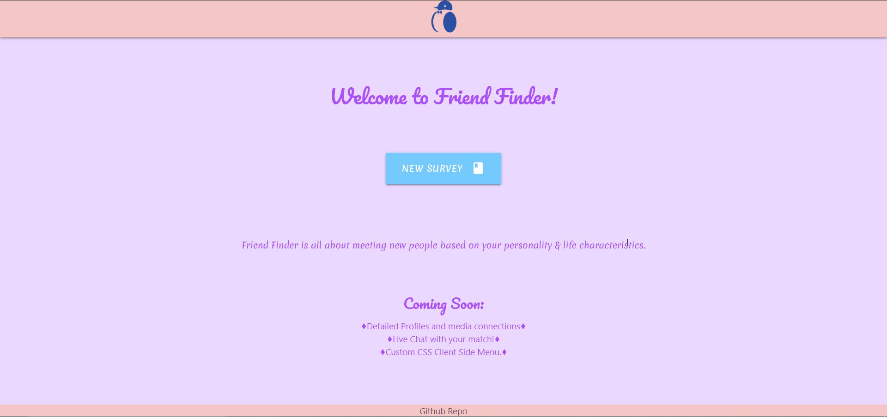

# FriendFinder

Want to try out the match maker yourself? [Visit Here!](https://friend-finder-sr.herokuapp.com/)

Take the friendly questionnaire by Friend Finder! A place to meet new people based on your personality and way of thinking. 

----

## Getting Started

You will need to download the entire repository, as all files are necessary, except for the Git folder. 

* The favicon folder will give the webpage a unique icon to be displayed on the browser tab and will be used by 3rd party applications that show icons. This folder is optional as well, but if you decide to remove it, you must remove their references in the html files.

If you would like to deploy on Heroku, it is recommended to fork this repo, clone it to your pc, make changes if needed, and then directly deploy to heroku.

----

### Prerequisites

#### Heroku
  * If you will deploy the project on Heroku, you must install the [Heroku CLI](https://devcenter.heroku.com/articles/heroku-cli#download-and-install) on your server or pc.
  * Next, open your project folder you have downloaded or forked, and run heroku create with a custom name:          
          
          heroku create Friend-Finder-unique-name

  * Once the application is created, copy the link provided. To deploy to Heroku, you may use git command:
          
          git push heroku master

  * After the terminal pushes the folder, heroku should then automatically deploy your application without a problem! 

You may visit the link provided by heroku to see it in action!

#### VPS or PC

In order to setup the project, you must have [NodeJS](https://nodejs.org/en/) installed on your machine. 

### Installing

* NodeJS has a built-in Node Package Manager ([NPM](https://www.npmjs.com/)), that installs all dependencies for the project using the package.json file to automatically setup the app for you when you run the command: `npm i`. Run this command in the project folder once you have downloaded NodeJS.

### Running 

After all packages have been installed, the last step is to run the application, using:

        node server.js

#### Port
* Currently the default port is set to 7500 ( the site would deploy to http://www.your-domain.com:7500 ) unless a "process.env.PORT" is already specified on the machine.

* If you run the site on your pc, the site would be http://localhost:7500

## Built With

* [Express]( https://www.npmjs.com/package/express )
* [JQuery]( https://jquery.com/download/ )
* [Materialize]( https://materializecss.com/ )

## Authors

* **Esar Behlum**